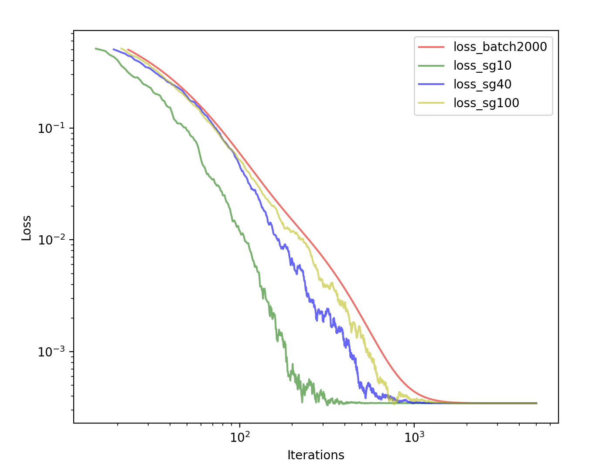
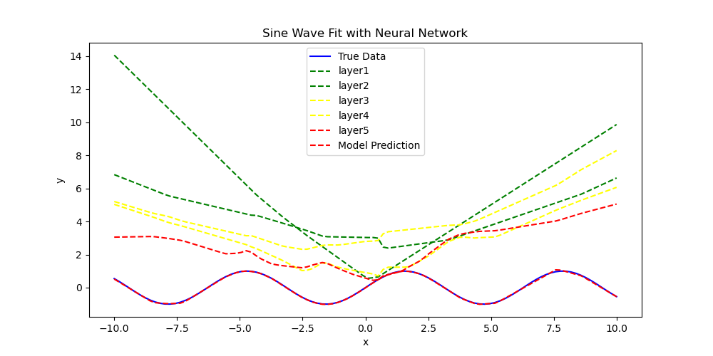

### References:
"Optimization Methods for Large-Scale Machine Learning"
"Nicolas Le Roux, Mark Schmidt, Francis Bach. A Stochastic Gradient Method with an Exponential Convergence Rate for Strongly-Convex Optimization with Finite Training Sets. 2012. hal- 00674995v1"

### Implementation:
As discussed in the references mentioned above, we are aware of the theoretical safeguards associated with Stochastic Gradient (SG) and batch methods. In this context, we are exploring an implementation using a strongly convex problem—specifically, the L2 regularized logistic problem.
\begin{equation}
\underset{x \in \mathbb{R}^p }{minimize} \left( \frac{\lambda}{2} ||x||^2 + \frac{1}{n} \sum_{i=1}^{n} \log(1 + \exp(-b_i a_i^T x)) \right)
\end{equation}

### Dataset 
At the outset, we initialize the dataset and labels as visualized in the graph. Subsequently, parameters are randomly initialized within the quadrant. As the training commences, the optimization process gradually shifts toward the center of the second quadrant. To visually represent this progression, varying transparencies are applied. Furthermore, the normalization of the parameter norm is implemented according to our objective function. This ensures that as the norm minimized towards zero, it remains distinctly visible.

### Logarithmic axis
It is evident that the batch method exhibits superior convergence values when compared to the Stochastic Gradient (SG) method. Additionally, the Stochastic Gradient method demonstrates improved convergence with a larger number of training points. This enhancement arises because, in the SG method, the batch size limits the number of points being optimized. Consequently, in subsequent rounds, the previous gradient information is overwritten by the newly chosen data points, affecting the optimization process.

#### Empirical loss

#### Expected loss

### Exploring Hidden Layers
The **Universal Approximation Theorem** states that a single hidden layer (with an unrestricted number of neurons) can approximate any continuous function. However, in practice, increasing the number of layers often results in better computational efficiency and accuracy (often stems from the fact that they leverage the **power of composition** to approximate functions more efficiently than shallow networks).
The following image provides an illustration of how different configurations of hidden layers approximate the sine wave function. This highlights the advantages of deeper architectures in capturing complex patterns:

